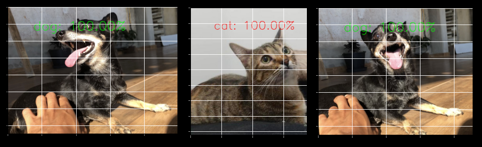

# Desafios do módulo de machine learning

* Este projeto realiza a classificação de imagens de gatos e cachorros com o modelo de Deep Learning MobileNetV2 do Keras. 

##### Dataset
A base de dados foi importada do kaggle e se encontra a baixo para download. 

[Clique aqui para fazer o download do Dataset](https://www.kaggle.com/datasets/tongpython/cat-and-dog)

##### Testes

* A imagem abaixo apresenta um simples teste realizado com imagens do meu cachorro e um gato de um amigo.

#### Referências: 
* [scikit-learn](https://scikit-learn.org/stable/index.html)

* [keras applications](https://keras.io/api/applications/)
